# Отчет по лабораторной работе № 2

### Сухарев Т. А.  Группа № 4316

---

## 1. Создание аккаунта на GitHub

- Аккаунт успешно создан на [GitHub](https://github.com/sskmsss).
- А также успешно привязан в Git Bash и новый файл через интерфейс GitHub.

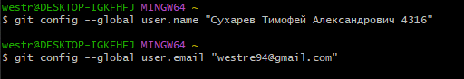

## 2. Копирование репозитория (Fork)

- Оригинальный репозиторий находится по адресу: https://github.com/Kurtyanik/LR6/.
- Репозиторий скопирован в личное хранилище с помощью кнопки **Fork**.

## 3. Установка Git

- Git установлен с официального сайта.

## 4. Клонирование репозитория и пулл изменений 

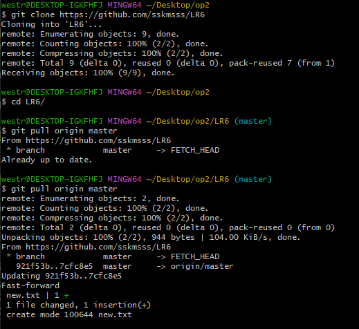

## 5. Вывод истории коммитов для каждой из веток

- История только для master, тк изначально других веток не существует.
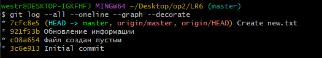

## 6. Проверка ветки с помощью git status
 
- При проверке видим, что все файлы зафиксированны.

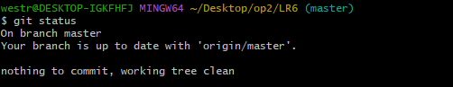

## 7. Создание и разрешение конфликта при слиянии веток

- Так как изначально была всего одна ветка, чего недостаточно, для конфликтной ситуации, создам ещё одну на которой будет создан файл conflict.txt и внесены в него некоторые изменения.

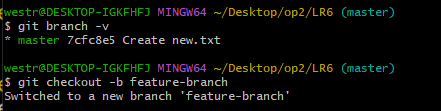

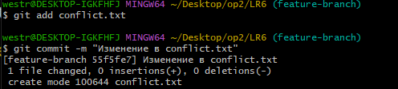

- Далее создаю такой же файл conflict.txt в master и вношу в него изменения, а потом приступаю к слиянию и получаю конфликт.

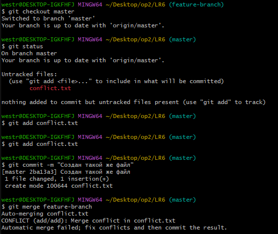

- Так выглядит конфликт внутри файла.
  
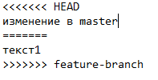

- Конфликт был решён, путём ручного внесения изменений в файл и их сохранения.
  
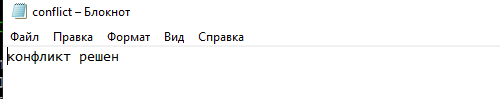

## 8. Фиксация изменений после разрешения конфликта и удаление ненужной ветки

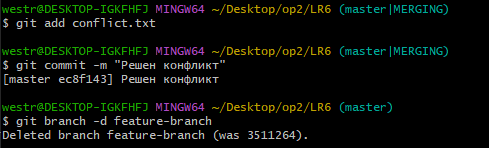

## 9. Откат последнего коммита

## 10. Создание отдельной ветки для отчета

## 11. Использованные команды
- git clone https://github.com/username/repo.git - Клонирование удалённого репозитория на локальный носитель
- git checkout -b new-branch - Создание новой ветки и переход на нее
- git add . - Фиксация всех незафиксированных файлов файлов
- git add FileName - Фиксация конкретного файла файла
- git commit -m "Added new feature" - Создание комментария
- git push origin new-branch - отправка коммитов в удалённый репозиторий

## 12. Получение истории операций в форматированном виде

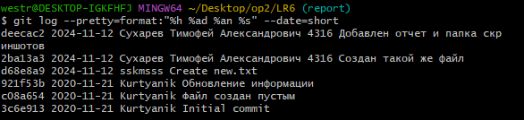

# Вывод:
В ходе выполнения лабораторной работы я освоил основные команды Git и GitHub, что существенно упростило совместную работу над проектами. Написание отчета в формате Markdown показало важность документирования процесса разработки.
